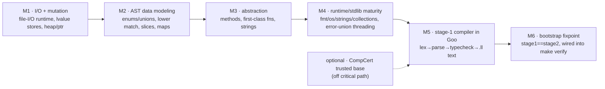

# Goo Self-Hosting: Assessment & Roadmap

## Context

The question: **is Goo mature enough to compile its own compiler (self-host)?** Self-hosting
("build the language with itself") is a stated Year-1 goal (`docs/01-VISION.md:201`). This document
records an evidence-based assessment of the gap and a staged roadmap to close it. No code is changed
here — it is a planning artifact to drive future milestones.

Methodology note: this codebase has a documented history of claims outrunning reality (the demo suite
we just repaired was "implemented" but bit-rotted). Findings below were verified by reading source and
inspecting the runtime build, not by trusting comments/docs.

## Assessment: No — and not close

Goo today compiles a **toy subset** end-to-end (lex → parse → typecheck → LLVM IR → object → link →
run). The real ceiling is `examples/baseline_probe.goo` (180 lines, 19 constructs: var decls,
arithmetic, control flow, functions/multi-return, simple structs+field read, error unions `!T`,
nullable `?T`, `println`/`fmt.Println`). The driver (`src/compiler/goo.c`) and backend
(`codegen_emit_executable`, `src/codegen/codegen.c:541`) genuinely produce native ELF binaries with
LLVM 22.

But self-hosting needs foundational capabilities that are **missing or broken**, not polish:

| Blocker | Status (verified) | Why fatal for a compiler |
|---|---|---|
| **File I/O** | `extern _sys_open/_sys_read/...` declared in `stdlib/os/os.goo:610+`; the runtime archive `lib/libgoo_runtime.a` (`RUNTIME_LIB`, `Makefile:87`) is a **build artifact** assembled from **concurrency-only** sources (`runtime.c platform.c concurrency.c channels.c sync.c`, `src/runtime/Makefile`) — **no I/O object**, so the `_sys_*` symbols have no backing | Can't read source input |
| **Lvalue assignment** (`s.x=`, `a[i]=`) | rejected at `src/codegen/expression_codegen.c:263` — any non-`AST_IDENTIFIER` target is "Assignment target must be an identifier" | Can't mutate symbol tables / grow AST arrays |
| **Enums / tagged unions** | no grammar rule in `src/parser/parser.y` | Can't represent AST nodes idiomatically |
| **Methods / receivers** | `func_decl` (`parser.y:247`) matches only `FUNC identifier LPAREN …`; no receiver form `func (r T) M()` | No idiomatic compiler structure |
| **First-class fns / closures** | only incidental func-pointer plumbing (`expression_codegen.c:165`, `statement_codegen.c:538`); no closure path | No visitor/dispatch tables |
| **Heap alloc / real pointers** | `&x`/deref buggy in typechecker; no `new` | Can't build linked/recursive structures |
| **Slices / general maps** | partial slice codegen; maps are the **minimum-viable string→int variant** only — `goo_map_{new,set,get}_si` (`runtime_integration.c:248`; "minimum-viable string→int variant", `composite_codegen.c:39`); `stdlib/map` unbacked | Core compiler containers |
| **Tag dispatch (`match`/`switch`)** | `match` has a **full grammar** (`match_expr`/`match_case`/`pattern`/`guard_condition`, `parser.y:1886`) but **no lowering** — zero `AST_MATCH`/`MatchExpr` refs in `src/types` or `src/codegen`, so it parses then dead-ends; `switch` is only a **token** (`parser.y:40`) with no grammar rule (unparseable) | Tag dispatch over AST nodes |

The existing `examples/tinygoo_v2.goo` "bootstrap pilot" is **not** a compiler: its own header says it
"ignores stdin and always emits the same hard-coded IR." Built via `bin/goo-ccomp` (the CompCert-built
compiler), it proves the *toolchain chain* (Goo→`goo-ccomp`-compiled→emits IR text→clang→binary),
which is valuable, but contains no compiler logic.

Scale for context: the C compiler is ~95k lines (`types` 23k, `codegen` 6k, `parser` 5.6k, `runtime`
3.3k, etc.). A Goo reimplementation need not match this, but the language must first be able to
*express* a compiler — which it cannot yet.

## Strategic decisions (shape the whole roadmap)

1. **Emit textual LLVM IR, not LLVM bindings.** The stage-1 Goo compiler should emit `.ll` text and
   shell out to `clang`/`llc` (the proven `tinygoo_v2` chain), avoiding the large effort of exposing
   the LLVM C-API to Goo via FFI. Biggest single scope reducer.
2. **Bootstrap in a restricted subset.** The self-hosted compiler only needs to support the subset of
   Goo *it is itself written in*. Deliberately write stage-1 in a minimal, conservative subset so
   Milestones 2–3 don't have to implement every language feature — only what the compiler's own source
   uses.
3. **Reuse the C runtime via `extern`.** Memory, file I/O, and syscalls can be C functions the Goo
   compiler calls through `extern` (already supported), rather than reimplemented in Goo.

## Roadmap shape (dependency order)

## Roadmap (staged; each milestone independently testable)

### M1 — I/O & mutation foundations *(unblocks writing any real program)*
- Implement real file-I/O runtime backing (`_sys_open/_sys_read/_sys_write/_sys_close`) as new C in
  `src/runtime/`. The runtime archive is assembled by `src/runtime/Makefile` and wired into the build
  via `RUNTIME_LIB` (`Makefile:87`); add the new sources to that `SOURCES` list and export the
  symbols, then let `stdlib/os/os.goo` reach them through its existing `extern` declarations. Add
  stdin/stdout and `os.Args`/argv exposure.
- Fix lvalue assignment in `src/codegen/expression_codegen.c:263` so `s.field = v` and `arr[i] = v`
  generate stores (GEP + store), not just identifier stores.
- Working heap allocation + pointer/reference semantics (`&x`, deref, a `new`/alloc path).
- Gate: a `.goo` program that opens a file, reads it, mutates a struct/array, writes output — compiles
  and runs.

### M2 — Data modeling for an AST
- Enums / tagged unions: grammar (`parser.y`) + typecheck (`src/types`) + codegen (discriminant +
  payload union).
- **Lower `match`**: add typecheck + codegen (discriminant + payload union) for the already-parsed
  `match` expression (`parser.y:1886`). Decide whether to also add a `switch` grammar rule or
  standardize on `match` for tag dispatch — `match` is the construct that already parses, so it is the
  lower-cost target.
- Complete dynamic slices (append/grow/index/len) end-to-end in codegen.
- General maps beyond string→int (at least string-keyed, generic value) for symbol tables/interning,
  replacing the `goo_map_*_si` minimum-viable variant.
- Gate: represent and walk a small tagged-union tree (mini-AST) with a `match` over the tag.

### M3 — Abstraction mechanisms *(only what stage-1 needs)*
- Methods/receivers: parse (`func (r T) M()`) + typecheck + codegen + static dispatch.
- First-class functions / function pointers (closures optional if stage-1 avoids captures).
- String manipulation a lexer needs: byte indexing, slicing, compare, length, int↔string conversion.
- Gate: a hand-written tokenizer in Goo that reads a file and prints a token stream.

### M4 — Runtime & stdlib maturity
- Back the stdlib surfaces stage-1 uses (`fmt`, `os`, `strings`, a collections/vector, a map) with
  real implementations, not `extern` stubs.
- Robust error-union propagation across call chains (compilers thread errors everywhere).
- Stable allocator under sustained allocation.
- Gate: a multi-hundred-line Goo program using collections + strings + file I/O runs leak-free
  (ASan/valgrind) — proving the substrate holds at compiler scale.

### M5 — Write the stage-1 compiler in Goo
- A minimal Goo compiler (lexer → parser → light typecheck → LLVM-IR-text emitter) for the restricted
  subset, structured to compile its own source. Target ~10–20k lines of Goo. Reuse the IR-text→clang
  chain from `tinygoo_v2`.
- Gate: stage-1 (built by the C compiler, "stage0") compiles a real input `.goo` to a working binary.

### M6 — Bootstrap & verify the fixpoint
- stage0 compiles `stage1.goo` → `stage1` binary.
- `stage1` compiles `stage1.goo` → `stage2` binary.
- **Verify `stage1` and `stage2` are byte-identical** (the canonical self-hosting proof).
- Add the fixpoint check to the `make verify` regression gate (see Verification).

### Optional parallel track — trusted base (CompCert)
`docs/COMPCERT_AUDIT.md` reports ~77% of compiler files compile under CompCert. Not required for
self-hosting; pursue only if a verified trusted base is a goal. Keep out of the critical path.

## Effort & sequencing
- M1–M4 are the bulk (language/runtime completeness) and are **multi-month**; the optimistic
  "10–15% away" framing does not survive the evidence above — these are load-bearing, not polish.
- M1 is the highest-leverage, most-isolated starting point (file I/O + lvalue assignment) and is the
  natural first milestone if/when execution begins.
- Dependencies are roughly linear M1→M2→M3→M4→M5→M6; within M2/M3 several items can parallelize.

## Verification (how we'll know it's achieved)
1. **Per-milestone gates** above — each is a concrete `.goo` program that must compile and run.
2. **Self-hosting proof (M6):** `diff stage1 stage2` is empty (bit-identical reproduction), wired into
   the `make verify` aggregate alongside the existing named probes (`baseline-probe`,
   `comptime-probe`, `m10-probe`, `m12-probe`, `ccomp-link`, `Makefile:239–339`) — mirroring how
   `comptime-probe` / `m10-probe` were folded into the gate once green.
3. **No-regression:** the current `demos` and `tests` CI workflows stay green throughout; new
   capabilities add probes rather than weakening existing gates.

## Out of scope (this document)
No code changes. No commitment to a timeline. Decomposing any single milestone (e.g. M1) into an
implementation plan is a separate brainstorming → writing-plans cycle.
